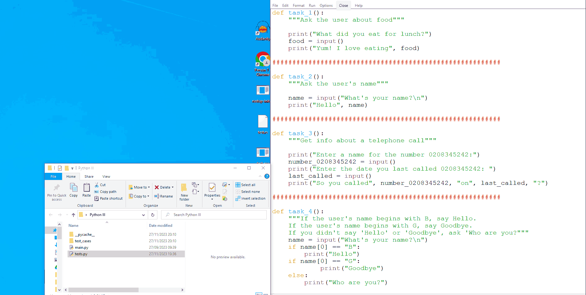

# replit_alternative

Some tools to help deal with replit's announcement that they are deprecating their Teams for Edu service.

## scrape_io_tests.py

A script that automates the process of exporting I/O tests from assignments (as these currently cannot be exported without clicking through every single test individually)

## io_test_runner.py

Run replit I/O tests locally using `unittest.mock.patch`.

